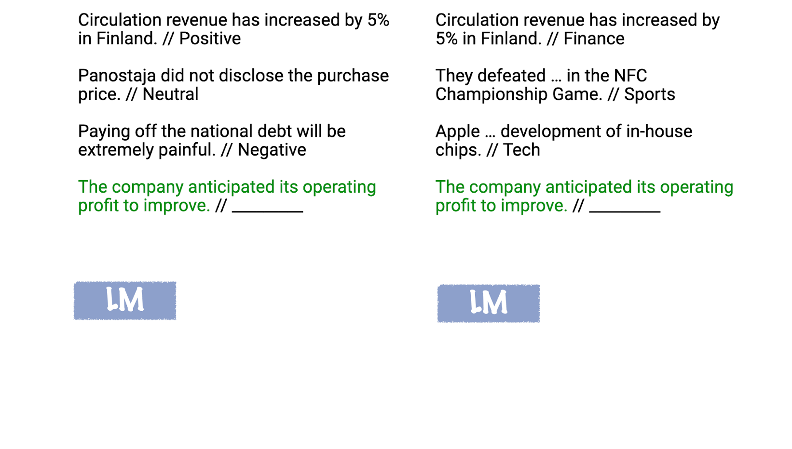

<p align="center">
	 </img>	 <br/>
	Harness XAI, demystify in-context learning, and elevate your LLMs—all at zero cost <br/>
</p>


## What is In-Context Learning(ICL)?

In-context learning enables a large language model(LLM) to perform tasks by observing patterns from examples provided in the input prompt, without updating its parameters.

<p align="center">

</p>

*Figure source: [In-Context Learning in Large Language Models](https://medium.com/@vjanand/in-context-learning-in-large-language-models-df6f486edf2c)*

## Why we need XAI for ICL?

- **Transparency**: XAI reveals how ICL identifies and applies patterns from prompts, improving trust and interpretability.  
- **Error Diagnosis**: Highlights why ICL fails, helping refine prompts and demonstrtaion selection.  
- **Bias Mitigation**: Identifies biases in ICL outputs to ensure fairness and robustness.  
- **Optimization**: Guides prompt engineering and dataset design for better performance.  


## Installation

   ```bash
# Installation
   conda create --name xicl python=3.10.15 -y
   conda activate xicl
   pip install -r requirements.txt
```

## Supported models

| Model | Reference | Description | XAI Technique |
| :---- | :-------- | :---------- | :------------ |
| Label Words as Anchors | [🗂️](https://github.com/h0ngxuanli/InContextLab/blob/main/incontextlab/src/information_flow_model.py), [📄](https://arxiv.org/abs/2305.14160) | Analyzes in-context learning by using label words as fixed reference points to track information flow within language models | Intrinsic Interpretability |
| LLMs as Latent Variable Models | [🗂️](https://github.com/h0ngxuanli/InContextLab/blob/main/incontextlab/src/latent_concept_model.py), [📄](https://arxiv.org/pdf/2301.11916) | Frames large language models as latent variable models to explain in-context learning and find optimal demonstrations | Surrogate Models |
| Semantic Induction Heads | [🗂️](https://github.com/h0ngxuanli/InContextLab/blob/main/incontextlab/src/semantic_head_model.py), [📄](https://arxiv.org/abs/2402.13055) | Identifies and analyzes semantic induction heads to understand in-context learning mechanisms in language models | Feature Attribution |
| Post Hoc Explanations | [🗂️](https://github.com/h0ngxuanli/InContextLab/blob/main/incontextlab/src/amplify_model.py), [📄](https://openreview.net/forum?id=3H37XciUEv) | Generates explanations after model predictions to improve performance and interpretability of language models | Surrogate Models |

## Model Explanations

<details>
<summary>Label Words as Anchors</summary>

### Label Words as Anchors
This implementation provides an interpretable, saliency-based framework for understanding attention mechanisms in transformer models. It emphasizes the pivotal role of label words in in-context learning tasks.


#### **1. Saliency Score Calculation**
- Attention matrices $A$  are extracted from each transformer layer.
- Gradients of the loss $L(x)$ with respect to attention matrices are computed to derive saliency scores:
  $$
  I_l(i, j) = \left| \sum_h A_{h,l}(i, j) \cdot \frac{\partial L(x)}{\partial A_{h,l}(i, j)} \right|
  $$
  - $A_{h,l}(i,j)$: Attention value for the $i$-th row and $j$-th column in the attention matrix of the $h$-th head at the $l$-th layer.
#### **2. Information Flow Metrics**
The saliency scores are used to compute three metrics that quantify attention's role in information transfer:

1. **Text-to-Label Flow ($S_{wp}$):**
   Measures the aggregation of information from text to label tokens:
   $$
   S_{wp} = \frac{\sum_{(i,j) \in C_{wp}} I_l(i, j)}{|C_{wp}|}
   $$

2. **Label-to-Target Flow ($S_{pq}$):**
   Evaluates how label words contribute to predictions:
   $$
   S_{pq} = \frac{\sum_{(i,j) \in C_{pq}} I_l(i, j)}{|C_{pq}|}
   $$

3. **General Token-to-Token Flow ($S_{ww}$):**
   Assesses information flow among non-critical tokens:
   $$
   S_{ww} = \frac{\sum_{(i,j) \in C_{ww}} I_l(i, j)}{|C_{ww}|}
   $$
#### **3. Connection Sets**
The metrics rely on predefined connection sets:
- **Text-to-Label ($C_{wp}$):** Links from text tokens to label tokens.
- **Label-to-Target ($C_{pq}$):** Links from label tokens to the target token.
- **Other Connections ($C_{ww}$):** All remaining token-to-token links.

#### **4. Implementation**
- **Input Tokenization:** The input text and labels are tokenized using the pre-trained tokenizer.
- **Anchor Identification:** Positions of label words are located in the tokenized sequence.
- **Attention Analysis:** Saliency scores are computed for all attention heads across layers.

#### **5. Anchor-Based Insights**
This analysis aligns with the "Label Words as Anchors" hypothesis:
1. **Shallow Layers:** Aggregate information around label tokens for semantic representation.
2. **Deep Layers:** Extract information from label tokens to make predictions.

#### **6. Applications**
The framework enables:
- **Error Diagnosis:** Identifies error demonstrations in prompts based on saliency patterns.
</details>


<details>
<summary>LLMs as Latent Variable Models</summary>


### LLMs as Latent Variable Models

This implementation frames large language models (LLMs) as latent variable models, optimizing in-context learning by selecting task-relevant demonstrations.


#### **1. Theoretical Framework**
- **Latent Variable Assumption:**
  LLMs implicitly infer a latent variable $\theta$ representing task information:
  $$
  P(w_{t+1:T} | w_{1:t}) = \int_\Theta P(w_{t+1:T} | \theta) P(\theta | w_{1:t}) d\theta
  $$
  - $\theta$: Encodes task and format.
  - $w_{1:T}$: Token sequence of the input text.

- **Bayes Optimal Predictor:**
  Labels are predicted by maximizing:
  $$
  \arg\max_{y \in Y} P(Y | \theta, X)
  $$

- **Causal Directions:**
  Two directions between input ($X$), label ($Y$), and latent variable ($\theta$):
  - $X \rightarrow Y \rightarrow \theta$: Labels depend on input and latent variable.
  - $Y \rightarrow X \rightarrow \theta$: Input depends on labels and latent variable.

---

#### **2. Demonstration Selection**
- **Latent Concept Learning:**
  - Adds task-specific tokens $\hat{\theta}_d$ to encode task context.
  - Optimizes embeddings using:
    $$
    L(\hat{\theta}_d) = \mathbb{E}[ -\log P(Y | \hat{\theta}_d, X)]
    $$
  - Embeddings are initialized with average token embeddings and fine-tuned.

- **Efficient Demonstration Selection:**
  - Choose $k$ demonstrations $(X_d, Y_d)$ that maximize:
    $$
    P(\theta_d | X_d, Y_d)
    $$
  - Assumes independence between demonstrations for efficient search.

#### **3. Applications**
- Enhances in-context learning by embedding task-relevant latent variables in an interpretable way.
- Reduces computational cost by selecting demonstrations using smaller models.
</details>


<details>
<summary>Semantic Induction Heads</summary>

### Semantic Induction Heads

#### **Semantic Induction Heads for Relationship Encoding**

This implementation explores the role of attention heads in transformer models as semantic induction heads, capturing high-level relationships like "Part-of" and "Used-for." It integrates QK and OV circuit analyses to extract token relationships.

#### **1. Theoretical Framework**
- **Semantic Induction Heads:**
  Attention heads encode token relationships using Query-Key (QK) and Output-Value (OV) circuits.
  $$
  \text{Attention}(Q, K, V) = \text{softmax}(QK^\top / \sqrt{d_k})V
  $$
  - QK circuit: Measures token affinity.
  - OV circuit: Stores semantic information for output generation.

- **Triplet-Based Relationships:**
  Relationships are represented as triplets $(\text{head}, \text{relation}, \text{tail})$, where attention heads capture the dependency between tokens.


#### **2. Relation Index Computation**
- **Objective:**
  Quantify the semantic relationship strength for each attention head:
  $$
  R_{l,h} = \frac{\sum_{\text{triplets}} \text{QK}_{ij} \cdot \text{OV}_{ij} \cdot f(\text{relation})}{\text{total triplets}}
  $$
  - $R_{l,h}$: Relation index for layer $l$ and head $h$.
  - $f(\text{relation})$: Semantic factor for the relationship type.

- **Procedure:**
  1. Extract attention patterns for each layer and head.
  2. Compute QK scores between head and tail tokens.
  3. Calculate OV scores from the projection weight matrix.
  4. Weight scores by semantic factors and normalize.


#### **3. Demonstration Processing**
- **Relation Indices:**
  Compute average relation indices across examples for attention head visualization.
- **Token Contributions:**
  Evaluate token-level importance using gradient-based scores:
  $$
  \text{Token Contribution}(i) = \frac{\|\nabla_{\text{Emb}(i)} L\|}{\sum_{j} \|\nabla_{\text{Emb}(j)} L\|}
  $$


#### **4. Applications**
- **Semantic Relationship Analysis:**
  Identifies heads encoding specific relationships like "Hyponym-of" or "Feature-of."
- **In-Context Learning:**
  Supports triplet-based reasoning for few-shot tasks.
- **Explainability:**
  Provides heatmaps for relation indices to visualize attention head roles.
</details>


<details>
<summary>Post Hoc Explanations</summary>

### Post Hoc Explanations

#### **AMPLIFY: Post Hoc Explanations for Few-Shot Learning**

This framework leverages MCS-based demonstration selection and gradient-based explanations to optimize in-context learning with interpretable prompts.


#### **1. Theoretical Framework**
- **Post Hoc Explanations:**
  Use gradients to attribute model predictions to input tokens, providing insights into key decision-making features:
  $$
  \text{Token Attribution}(i) = \|\nabla_{\text{Emb}(i)} L\|_2
  $$
  - \(L\): Loss function.
  - \(\text{Emb}(i)\): Embedding of the \(i\)-th token.

- **Misclassification Confidence Score (MCS):**
  Quantifies prediction uncertainty by comparing true and predicted class probabilities:
  $$
  \text{MCS}(x) = P(y \mid x) - \max_{y' \neq y} P(y' \mid x)
  $$
  - Samples with negative MCS are prioritized for inclusion in the few-shot prompt.


#### **2. Explanation Generation**
- **Vanilla Gradients:**
  Compute token attributions directly from the gradients of the target class:
  $$
  \text{Attribution}(i) = \|\nabla_{\text{Emb}(i)} L_{y_{\text{true}}}\|_2
  $$
- **Contrastive Gradients:**
  Generate explanations by contrasting the gradients of the true class and predicted class:
  $$
  \text{Contrastive Attribution}(i) = \|\nabla_{\text{Emb}(i)} L_{y_{\text{true}}} - \nabla_{\text{Emb}(i)} L_{y_{\text{pred}}}\|_2
  $$

#### **3. Demonstration Selection**
- **Objective:**
  Select top-$k$ examples with the most informative negative MCS values.
- **Procedure:**
  - Compute MCS for each example.
  - Sort samples by the lowest MCS (most negative).
  - Select top-$k$ examples to form the few-shot prompt.


#### **4. Prompt Generation**
- **Rationale Template:**
  Incorporate token explanations as rationales:
  ```
  Input: <Text>
  Rationale: The key words: <Keyword1>, <Keyword2>, ... are crucial clues for predicting <Label>.
  Label: <Label>
  ```


### **5. Applications**
- **Few-Shot Learning:**
  Enhances in-context learning performance by selecting and explaining key demonstrations.
- **Interpretability:**
  Provides post hoc token-level explanations for model predictions.
- **Visualization:**
  Supports heatmap generation for token contributions and decision-making insights.
</details>


## References

1. **Label Words are Anchors: An Information Flow Perspective for Understanding In-Context Learning**

   *Authors:* Lean Wang, Lei Li, Damai Dai, Deli Chen, Hao Zhou, Fandong Meng, Jie Zhou, Xu Sun

   *Repository:* [https://github.com/lancopku/label-words-are-anchors](https://github.com/lancopku/label-words-are-anchors)

2. **Large Language Models Are Latent Variable Models: Explaining and Finding Good Demonstrations for In-Context Learning**

   *Authors:* Xinyi Wang, Wanrong Zhu, Michael Saxon, Mark Steyvers, William Yang Wang

   *Publication:* Proceedings of NeurIPS 2023

   *Link:* [https://arxiv.org/abs/2301.11916](https://arxiv.org/abs/2301.11916)

3. **Identifying Semantic Induction Heads to Understand In-Context Learning**

   *Authors:* Jie Ren, Qipeng Guo, Hang Yan, Dongrui Liu, Xipeng Qiu, Dahua Lin

   *Publication:* Findings of the Association for Computational Linguistics: ACL 2024

   *Link:* [https://aclanthology.org/2024.findings-acl.412/](https://aclanthology.org/2024.findings-acl.412/)

4. **Post Hoc Explanations of Language Models Can Improve Language Models**

   *Authors:* Satyapriya Krishna, Jiaqi Ma, Dylan Slack, Asma Ghandeharioun, Sameer Singh, Himabindu Lakkaraju

   *Link:* [https://arxiv.org/abs/2305.11426](https://arxiv.org/abs/2305.11426)